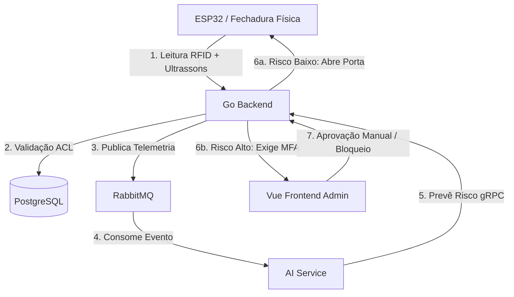

# Fechadura Inteligente com Deteção de Anomalias e Avaliação de Risco Baseada em IA

## Apresentação do Projeto — Inteligência Artificial Aplicada (IIA)

---

### 👥 Autores (Membros do Grupo)

- `[Hugo Lopes]` | `240001078`
- `[João Frajuca]` | `240001499`
- `[Rodrigo Ventura]` | `240001108`
- `[Rúben Alves]` | `210100338`

---

## 1. Introdução e Contexto do Projeto (O Ecossistema IoT)

Para compreender o papel da Inteligência Artificial, é necessário perceber o fluxo e a arquitetura do sistema global. O projeto consiste numa **Fechadura Inteligente** com controlo de acessos centralizado e resiliência local.

### O Fluxo Edge-to-Cloud



1. **Edge (Dispositivo Físico)**: Um microcontrolador ESP32 equipado com leitor RFID (MFRC522) e sensor de ultrassons (HC-SR04) para gating físico e medição de proximidade. Opera num modelo _Offline-First_ recorrendo a uma cache local em memória não-volátil (NVS Preferences) caso perca a ligação à rede.
2. **Backend de Orquestração (Go)**: Processa transações síncronas de validação de cartões em PostgreSQL, gere filas de mensagens assíncronas via RabbitMQ para telemetria de sensores, e monitoriza a integridade do sistema no InfluxDB.
3. **Frontend Administrativo (Vue.js)**: Painel web premium onde os administradores gerem utilizadores, validam pedidos pendentes, respondem a alertas de Autenticação Multi-Fator (MFA) em tempo real via WebSockets, e acompanham o treino e avaliação do modelo de IA.

---

## 2. O Papel e Funcionamento da Inteligência Artificial

O **`ai-service`** é um microserviço autónomo escrito em Python, utilizando as bibliotecas `Keras` e `TensorFlow`. O seu papel principal é analisar a telemetria física do ponto de acesso e avaliar a **severidade de risco** de cada tentativa de entrada.

### A Entrada do Modelo (Atributos / Features)

A rede neuronal avalia cada tentativa de acesso com base em 3 atributos normalizados no intervalo $[0, 1]$:

1. **Falhas Consecutivas (`fails`)**: Número de tentativas seguidas de leitura com cartões inválidos ou não autorizados. Valores $\ge 5$ são limitados (_clamped_) a $1.0$.
2. **Distância de Aproximação (`distance_cm`)**: Proximidade física medida pelo sensor de ultrassons no momento da leitura. Distâncias $\ge 150\text{ cm}$ são limitadas a $1.0$.
3. **Indicador de Negação de Acesso (`is_denied`)**: Valor binário ($0.0$ ou $1.0$) fornecido pelo backend que indica se o cartão tem ou não acesso concedido na base de dados.

### As Classes de Saída (Classificação Multiclasse)

O modelo classifica o risco em 4 níveis distintos:

- **Classe 0 (Sem Risco / Normal)**: Utilização padrão, sem falhas e distância de segurança adequada.
- **Classe 1 (Irregular)**: Comportamento ligeiramente fora do comum (ex: uma falha isolada de leitura a distância normal).
- **Classe 2 (Suspeito)**: Padrão que foge ao habitual (ex: aproximação física excessiva combinada com negação de acesso).
- **Classe 3 (Crítico)**: Ameaça de segurança ativa (ex: tentativa de força bruta com múltiplas falhas consecutivas muito próximo do sensor).

---

## 3. Arquitetura Técnica do Modelo (Rede Neuronal)

O modelo implementa uma **Rede Neuronal Artificial Feedforward (Multi-Layer Perceptron)**:

```
[Entrada: 3 Features]
       │
       ▼
[Camada Oculta 1: 16 Neurónios + ReLU]
       │
       ▼
[Camada Oculta 2: 16 Neurónios + ReLU]
       │
       ▼
[Camada de Saída: 4 Neurónios + Softmax] ──> [Probabilidades das 4 Classes]
```

- **Funções de Ativação**:
  - **ReLU (Rectified Linear Unit)** nas camadas ocultas para introduzir não-linearidade: $f(x) = \max(0, x)$.
  - **Softmax** na camada de saída para obter uma distribuição de probabilidade normalizada sobre as 4 classes de severidade.
- **Otimizador**: **Adam (Adaptive Moment Estimation)** para convergência rápida e adaptabilidade do gradiente.
- **Função de Perda**: **Sparse Categorical Cross-Entropy**, ideal para prever classes codificadas como inteiros diretamente.

### Pipeline de Dados e Concorrência

O microserviço de IA escuta a fila RabbitMQ assincronamente para registar eventos no dataset local (`sensor_events.csv`). A inferência e o treino operam sob concorrência protegida por trincos (`threading.Lock`), evitando condições de corrida (_race conditions_) nas previsões gRPC.

---

## 4. Objetivos do Projeto e da IA

### Objetivos Gerais do Projeto

- **Resiliência e Disponibilidade (Offline-First)**: Garantir que a fechadura funciona perfeitamente em modo autónomo (offline) durante falhas de rede, sem comprometer a gestão centralizada online em situações normais.
- **Segurança e Monitorização Ativa**: Criar uma infraestrutura distribuída que reporta constantemente o estado da fechadura e a saúde de todos os serviços (Postgres, RabbitMQ, gRPC) com armazenamento em séries temporais (InfluxDB).
- **Gestão Intuitiva**: Disponibilizar uma interface web centralizada para controlo de utilizadores e autorizações em tempo real.

### Objetivos Específicos da Inteligência Artificial

- **Deteção Inteligente de Intrusões em Tempo Real**: Diferenciar falhas de leitura casuais (como encostar a carteira com múltiplos cartões) de tentativas intencionais de força bruta ou intrusão física.
- **Políticas Reativas de Cibersegurança**:
  - Quando o risco é **baixo** (Classes 0 e 1), a porta abre de imediato.
  - Quando o risco é **suspeito ou crítico** (Classes 2 e 3), o backend retém a tranca e gera um pedido de **MFA (Multi-Factor Authentication)** via WebSocket para o painel do administrador, delegando a decisão final a um humano ou bloqueando permanentemente o cartão na base de dados.
- **Melhoria Contínua Dinâmica (Self-Supervised Pipeline)**: Permitir o re-treino dinâmico do modelo através do painel de administração sempre que o volume de telemetria acumulado se expandir, adaptando o classificador aos comportamentos reais registados no local.
